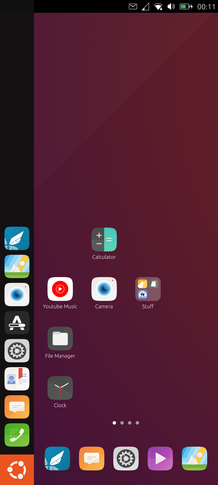
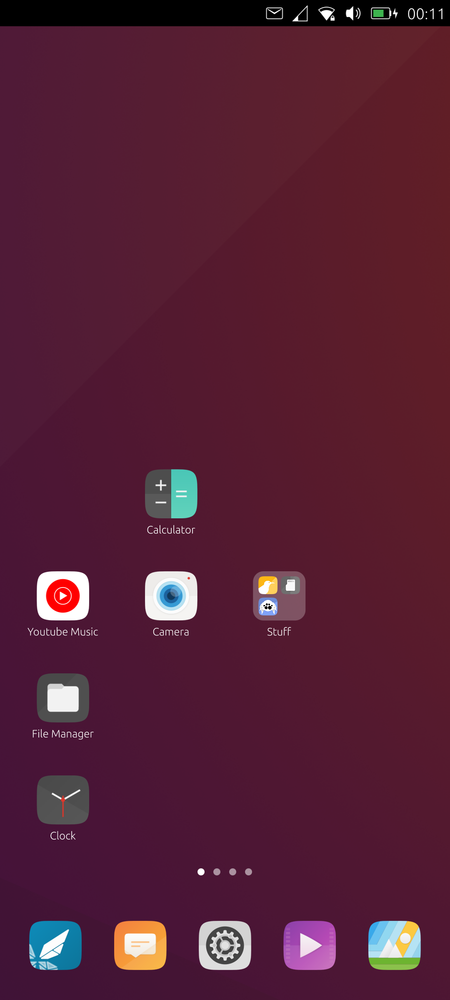
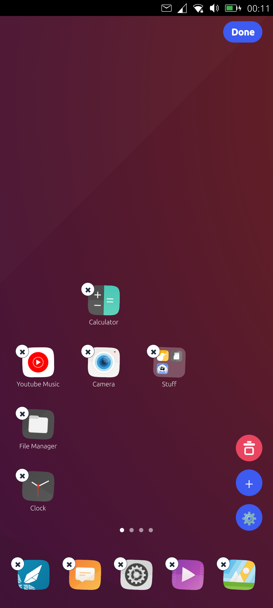
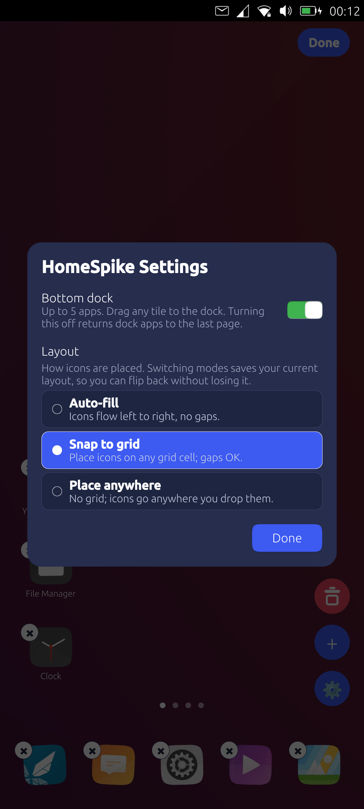
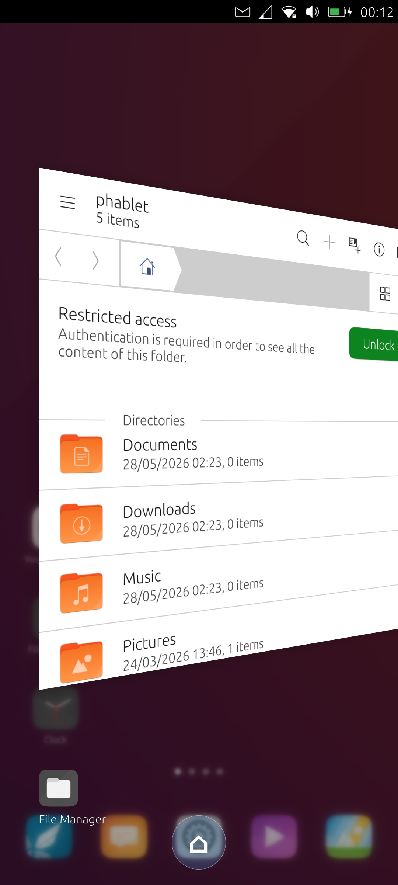
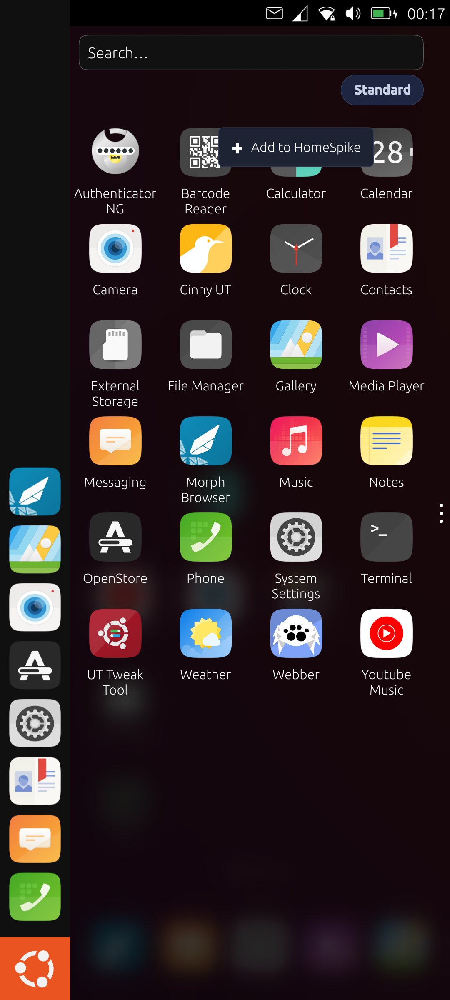

# HomeSpike

> **Unofficial fork.** A personal, independently maintained fork of TeamIDE's [HomeSpike](https://github.com/TeamIDE/HomeSpikev1). **Not affiliated with, endorsed by, or supported by TeamIDE** — don't contact them for help with this fork. "TeamIDE" names and trademarks belong to their respective owners.

Licensed [GPL-2.0-or-later](LICENSE.md). No warranty. Modifies Lomiri shell files in `/usr/share/lomiri/` and remounts `/` as rw — read [`install.sh`](deploy/install.sh) before running. Every file touched is preserved as `.orig`; [`uninstall.sh`](deploy/uninstall.sh) restores them.

---

A custom **home surface** for Ubuntu Touch (Lomiri). Replaces "drawer-as-default" with what most people actually expect: a wallpapered home grid you land on after unlock, swipeable pages you add and remove on the fly, an optional dock, **app folders**, a drag-to-reorder edit mode, and three different placement modes so you can lay your icons out the way you want.

HomeSpike is loaded **inside the lomiri shell process** as the background layer (where the wallpaper used to live), so it never appears as a separate app in the task switcher and survives whatever the shell does to surfaces. The Lomiri drawer is still there — long-press an app in it to send the app to your HomeSpike grid.

## Screenshots

<table>
  <tr>
    <td align="center" width="33%">
      <a href="pictures/01-home-grid-with-launcher.png"></a><br>
      <sub><b>Home grid</b><br>Default layout, launcher panel on left, page-dot indicator at the bottom</sub>
    </td>
    <td align="center" width="33%">
      <a href="pictures/02-home-with-dock.png"></a><br>
      <sub><b>Home + dock</b><br>Dock at bottom; the launcher panel auto-collapses when the dock is on</sub>
    </td>
    <td align="center" width="33%">
      <a href="pictures/03-edit-mode.png"></a><br>
      <sub><b>Edit mode</b><br>Long-press a tile: × badges, Done pill, settings gear</sub>
    </td>
  </tr>
  <tr>
    <td align="center" width="33%">
      <a href="pictures/04-settings-layout-modes.png"></a><br>
      <sub><b>Settings</b><br>Dock toggle and the three placement modes (pages are managed from edit mode)</sub>
    </td>
    <td align="center" width="33%">
      <a href="pictures/05-spread-home-button.png"></a><br>
      <sub><b>Spread home button</b><br>Right-swipe spread gets a home button to drop straight back to HomeSpike</sub>
    </td>
    <td align="center" width="33%">
      <a href="pictures/06-drawer-add-to-homespike.png"></a><br>
      <sub><b>Add to HomeSpike</b><br>Long-press any app in Lomiri's drawer → "Add to HomeSpike"</sub>
    </td>
  </tr>
</table>

## Device support

Works on **any Ubuntu Touch 24.04 (noble) device running Lomiri**, regardless of CPU architecture. Built and tested on the Poco X3 NFC (`surya`, aarch64); the design has no device-specific assumptions and the install pushes plain QML files that lomiri loads via its own QML import paths.

Requirements:

- Ubuntu Touch with **Lomiri** as the shell (pre-Lomiri Unity 8 won't work)
- Developer mode enabled (Settings → About → Developer Mode)
- Known phablet **sudo PIN** (set under Privacy → Security)
- `adb` connection from a host (Mac or Linux)
- Comfortable with the install touching four files under `/usr/share/lomiri/` — each is backed up as `.orig` and `uninstall.sh` restores them cleanly

What's **not** guaranteed:

- **Older or pre-noble UT releases.** The install drops complete replacement copies of four shell QML files (Shell, Stage, Spread, Drawer). A major Lomiri rewrite would mean re-syncing those copies. Re-run `install.sh` and watch for QML errors in `journalctl --user -u lomiri`.
- **Non-Lomiri shells** (Plasma Mobile on Droidian, Phosh, Sailfish, postmarketOS Sxmo) — entirely different shell stacks, would need a separate port.

If you run it on a device the README doesn't list, expect to verify the four shell overrides apply cleanly — watch `journalctl --user -u lomiri` for QML errors after install.

## What you get after `install.sh`

- Boot → unlock → **HomeSpike is already there**, fullscreen, under everything.
- Tap the **Ubuntu logo** (BFB) on the launcher → minimizes any open app to reveal HomeSpike.
- Right-edge swipe → app spread, now with a **home button** at the bottom to return to HomeSpike.
- Bottom **dock** (optional) for up to 5 apps.
- App grid (4 columns) of every installed app, swipeable across **1–5 pages**.
- Long-press any tile or empty space to toggle **edit mode**.
- **Add and remove pages** from edit mode.
- **Folders** — drop one app on top of another to make a folder; name it in the popup. Open a folder to launch, rename, rearrange, add, or pull apps back out. (See [Folders](#folders).)
- Long-press any app in the **Lomiri drawer** to add it to homespike.
- **Three placement modes** — Auto-fill, Snap to grid, Place anywhere.

## Placement modes

Pick one in Settings (open edit mode → tap the gear in the bottom-right):

| Mode             | What it does                                                                                                                                  |
| ---------------- | --------------------------------------------------------------------------------------------------------------------------------------------- |
| **Auto-fill**    | Default. Icons flow left-to-right, top-to-bottom with no gaps. Drag to reorder.                                                               |
| **Snap to grid** | Icons sit on a 4-column grid but can leave gaps. Drop on an empty cell → tile snaps there. Drop on an occupied cell → swap with the occupant. |
| **Place anywhere** | No grid. Drop anywhere; icons can overlap. Maximum freedom, minimum guard-rails.                                                            |

Switching modes preserves each mode's last saved layout. Flipping back to a mode you used before restores exactly what you had. First-time visits seed from your auto-fill layout so you're never dropped on a blank page.

## Folders

Folders group apps on the grid and work in all three placement modes.

- **Create** — drag one app on top of another. A popup asks for a name (or Cancel). The folder takes the target's spot and shows a 2×2 preview of its contents.
- **Open** — tap a folder to open it. The name sits above a translucent card of the member apps; tap an app to launch it. Tapping a folder works in edit mode too, so you can open it to make changes.
- **Rename** — tap the name above the open folder and type.
- **Add more** — drag another app onto a folder to drop it in (no popup).
- **Rearrange inside** — long-press a member, then drag to reorder it within the folder.
- **Pull an app out** — drag a member past the card edge; the folder fades away to reveal the grid so you can drop the app wherever you want.
- **Auto-dissolve** — remove apps until one is left and the folder turns back into a normal icon; remove the last and it's gone.
- **Delete** — the folder's edit-mode × removes the whole folder and its apps from HomeSpike (the apps stay installed and can be re-added from the drawer).

Close the open folder by tapping outside it. Folders live on the grid only — they can't be placed in the dock.

## How it works

HomeSpike is a QML tree loaded by `Loader` at `z: -2` inside Lomiri's own `Stage.qml`, replacing the original `Wallpaper` element. Because it lives inside the lomiri process and isn't a separate application surface, it never shows up in `topLevelSurfaceList` — no spread filtering, no autostart wrapper, no separate `.desktop` file.

| Piece                                       | Lives at (on device)                              | Source                              |
| ------------------------------------------- | ------------------------------------------------- | ----------------------------------- |
| HomeSpike QML tree                          | `/opt/home-spike/`                                | `app/`                              |
| Lomiri shell (BFB rewire, launcher-collapse) | `/usr/share/lomiri/Shell.qml`                     | `app/lomiri-overrides/Shell.qml`    |
| Lomiri stage (loads HomeSpike at z=-2)      | `/usr/share/lomiri/Stage/Stage.qml`               | `app/lomiri-overrides/Stage.qml`    |
| Lomiri spread (adds home button)            | `/usr/share/lomiri/Stage/Spread/Spread.qml`       | `app/lomiri-overrides/Spread.qml`   |
| Lomiri drawer (adds "Add to HomeSpike")     | `/usr/share/lomiri/Launcher/Drawer.qml`           | `app/lomiri-overrides/Drawer.qml`   |
| Cross-process add inbox (file-based IPC)    | `/home/phablet/.config/home-spike/pending-adds.txt` | created by install                |
| Saved layout & settings                     | `/home/phablet/.config/home-spike/home-spike.conf`  | written by HomeSpike at runtime    |

### Lomiri overrides (full files, no sed)

Every shell file we modify is shipped as a complete replacement copy under `app/lomiri-overrides/`. Install backs up the original as `.orig` and copies our version in. No surgical sed patches — `ls app/lomiri-overrides/` lists every system file HomeSpike touches.

- **`Shell.qml`** — Re-wires the Ubuntu-logo BFB to `stage.minimizeAllWindows()` (so HomeSpike is revealed) instead of opening the drawer; gates `launcher.lockedVisible` on HomeSpike's `dockEnabled` so the panel auto-collapses when the dock is on.
- **`Stage.qml`** — Replaces the original `Wallpaper` element with a `Loader` pointing at `file:///opt/home-spike/main.qml`; binds the loaded item's `leftReserve` to the launcher width so HomeSpike's grid insets when the panel is visible; exposes `homeSpikeDockEnabled` for the Shell launcher-collapse binding; wires the spread's new `homeRequested` signal to minimize-all.
- **`Spread.qml`** — Adds a circular home button at the bottom-center of the spread, gated on the spread being shown so its MouseArea doesn't swallow taps when collapsed.
- **`Drawer.qml`** — Adds a long-press context menu with an "Add to HomeSpike" item that appends the appId to the cross-process inbox file.

`install.sh` is idempotent — re-run safely after any Lomiri update to reapply every override. `uninstall.sh` restores every `.orig`.

### Wallpaper resolution

HomeSpike does its own wallpaper rendering inside its main.qml — same precedence Lomiri's own shell uses:

1. `AccountsService.backgroundFile` (the user's choice from Settings)
2. `com.lomiri.Shell` gsettings → `background-picture-uri`
3. Hardcoded default

`AccountsService.backgroundFile` returns a bare path; we prefix it with `file://` before handing it to the Image source.

### App enumeration

- `AppDrawerModel` from `Lomiri.Launcher 0.1` — the same model the drawer uses
- Wrapped in `AppDrawerProxyModel` from `Utils 0.1` for A–Z sort
- Tap → `Qt.openUrlExternally("application:///" + model.appId + ".desktop")` → Lomiri's URL dispatcher hands off to UAL

### Cross-process "Add to HomeSpike"

The patched `Drawer.qml`'s long-press context menu writes the appId to `/home/phablet/.config/home-spike/pending-adds.txt`. HomeSpike polls that file roughly every 1.5 seconds and pulls in any new entries. No D-Bus dance — it's a file.

## Usage

Phone connected via adb, developer mode on:

```bash
# fresh install (pushes files, replaces four Lomiri shell files, reboots)
PIN=<sudo-pin> ./deploy/install.sh

# dev iteration of HomeSpike code only (no Lomiri shell touch, restarts lomiri)
PIN=<sudo-pin> ./deploy/refresh.sh

# dev iteration AND re-push the four Lomiri overrides
PIN=<sudo-pin> LOMIRI=1 ./deploy/refresh.sh

# revert everything (restore all four .orig files, remove /opt/home-spike, reboot)
PIN=<sudo-pin> ./deploy/uninstall.sh
```

The `PIN` is your phablet sudo PIN (Settings → Privacy → Security). `adb` is discovered via the `$ADB` env override, then your `PATH`.

## Known limitations / next steps

- **OTA wipes overrides.** Re-run `install.sh` after any system update.
- **Lomiri restarts log you to the greeter.** Lomiri caches QML aggressively, so iterating on the overrides means `refresh.sh LOMIRI=1` which `pkill`s lomiri — you'll see the greeter, unlock to continue.
- **No widget API yet.** A widget system is the next milestone — see [`docs/WidgetAPI.md`](docs/WidgetAPI.md) for the v2 scoping. Widgets are plain QML loaded into HomeSpike's process for v2.0 (first-party only); v2.1 adds out-of-process Click-app widgets via Mir-surface compositing for third-party apps.
- **App launch from cards** uses `Qt.openUrlExternally("application:///")` which works through the URL dispatcher. If AppArmor ever blocks it, the fallback is direct `ApplicationManager.startApplication()` — but that needs more shell-level privileges.

## Tested devices

| Device       | Codename | Arch    | UT version  | Notes            |
| ------------ | -------- | ------- | ----------- | ---------------- |
| Poco X3 NFC  | surya    | aarch64 | 24.04 noble | Reference device |
