# HomeSpike

> **Unofficial fork** of TeamIDE's [HomeSpike](https://github.com/TeamIDE/HomeSpikev1) — not affiliated with, endorsed by, or supported by TeamIDE; don't contact them about this fork. Licensed [GPL-2.0-or-later](LICENSE.md), no warranty.

A real **home screen** for Ubuntu Touch (Lomiri). Instead of landing on the app drawer, you land on a wallpapered grid you arrange yourself — swipeable pages, folders, widgets, an optional dock, and a drag-to-reorder edit mode.

HomeSpike runs *inside* the Lomiri shell as the background layer, so it's there the instant you unlock and never shows up as a separate app. The drawer is still one swipe away — long-press any app in it to send it to your grid.

## What's new in v2

- **🕒 Widgets.** Drop a **clock** or **calendar** onto the grid. Each one toggles between a plate and a transparent background, lets you **recolour every section** (the clock's time, the calendar's month / day / weekday / today) with a full **HSV + opacity picker** — with hex and R/G/B/A entry so you can match colours exactly — and comes in multiple sizes. Time and dates follow your system 12/24-hour setting and locale. Widgets drag and carry across pages like any icon.
- **🔄 Landscape that actually works, iOS-style.** Turn the phone and your icons, labels, and widgets **spin upright in place** — the grid never reflows or jumps. The home stays portrait-pinned even with auto-rotate on, and the drawer relays out for landscape with its side-panel icons re-oriented too. Flip on **Rotation Lock** and everything simply stays portrait.

## Screenshots

<table>
  <tr>
    <td align="center" width="33%">
      <a href="pictures/Home-Grid.png">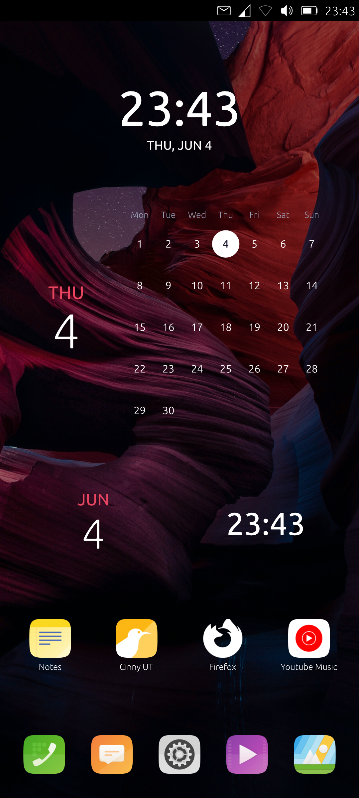</a><br>
      <sub><b>Home grid</b></sub>
    </td>
    <td align="center" width="33%">
      <a href="pictures/Home-Grid-Panel.png">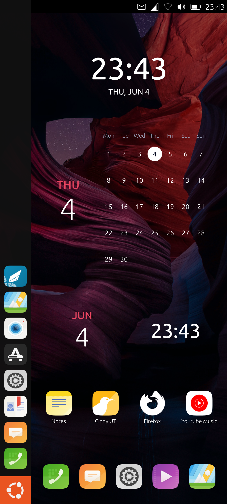</a><br>
      <sub><b>Home grid + launcher panel</b></sub>
    </td>
    <td align="center" width="33%">
      <a href="pictures/Edit-Mode.png">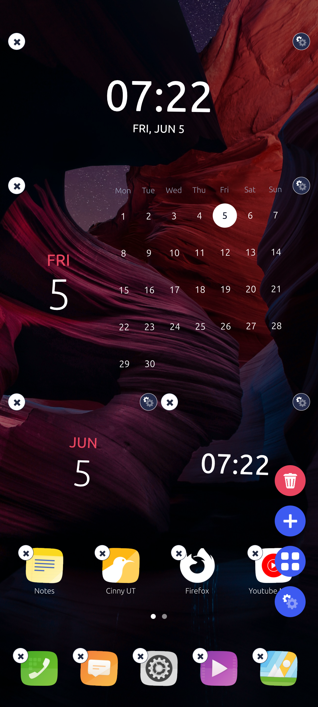</a><br>
      <sub><b>Edit mode</b> — widgets + controls</sub>
    </td>
  </tr>
  <tr>
    <td align="center" width="33%">
      <a href="pictures/Widget-Settings.png">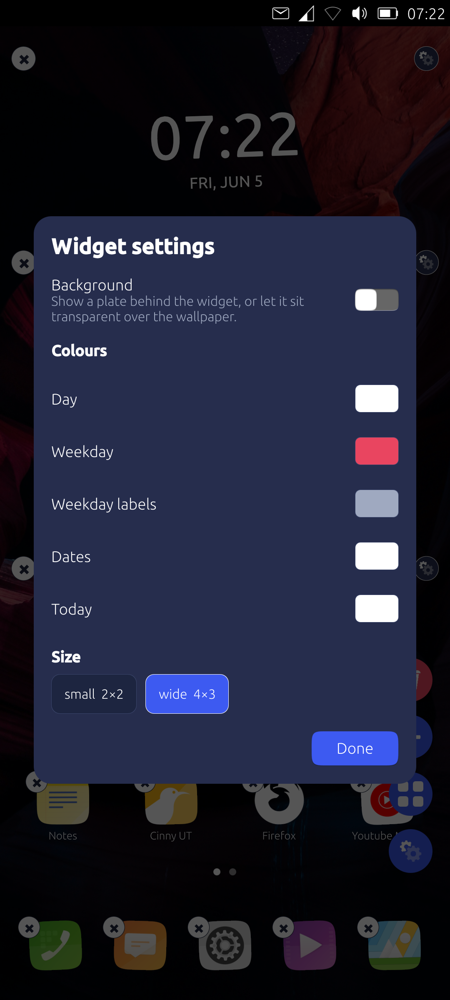</a><br>
      <sub><b>Widget settings</b> — colours + size</sub>
    </td>
    <td align="center" width="33%">
      <a href="pictures/HomeSpike-Settings.png">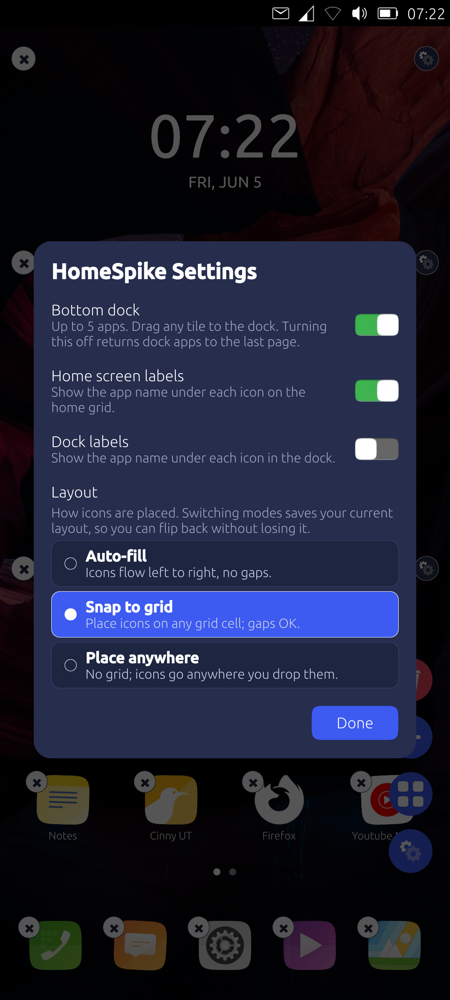</a><br>
      <sub><b>Settings</b> — dock, labels, layout</sub>
    </td>
    <td align="center" width="33%"></td>
  </tr>
</table>

**App drawer** — Standard, A-Z, and Categories view modes:

<table>
  <tr>
    <td align="center" width="33%">
      <a href="pictures/Drawer-Portrait-Mode1.png">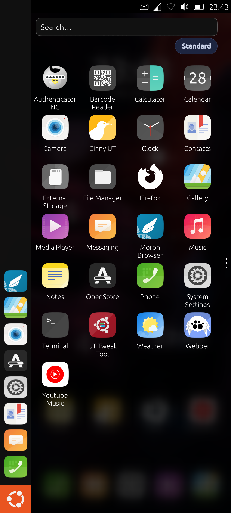</a><br>
      <sub><b>Standard</b></sub>
    </td>
    <td align="center" width="33%">
      <a href="pictures/Drawer-Portrait-Mode2.png">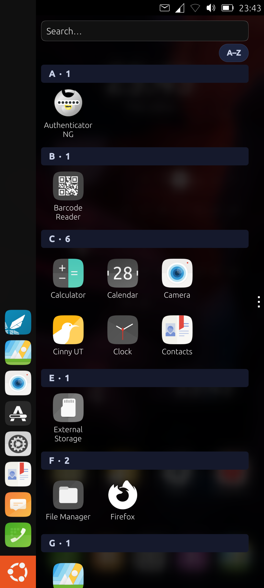</a><br>
      <sub><b>A-Z</b></sub>
    </td>
    <td align="center" width="33%">
      <a href="pictures/Drawer-Portrait-Mode3.png">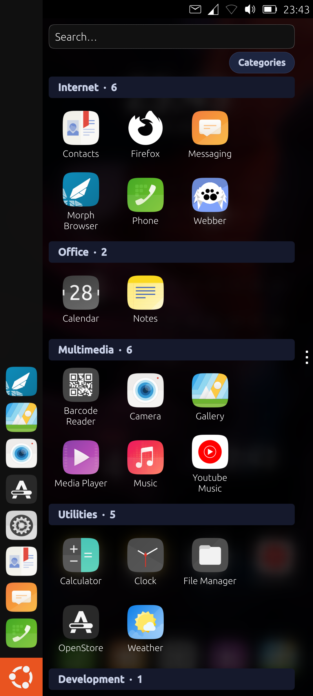</a><br>
      <sub><b>Categories</b></sub>
    </td>
  </tr>
</table>

### Landscape

Turn the phone and everything re-orients in place — the home grid stays put while icons, labels, and widgets spin upright, and the drawer relays out for landscape:

<table>
  <tr>
    <td align="center" width="50%">
      <a href="pictures/Home-Grid-Landscape.png">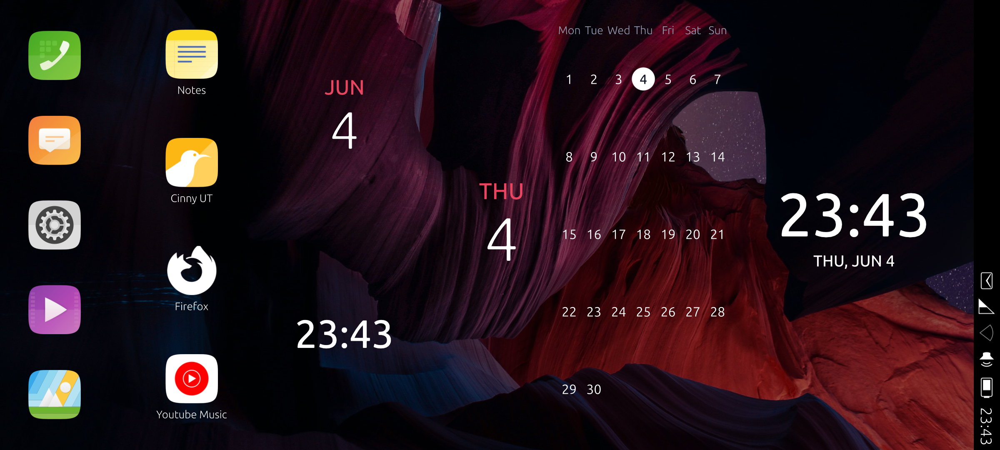</a><br>
      <sub><b>Home grid</b></sub>
    </td>
    <td align="center" width="50%">
      <a href="pictures/Drawer-Landscape-Mode1.png">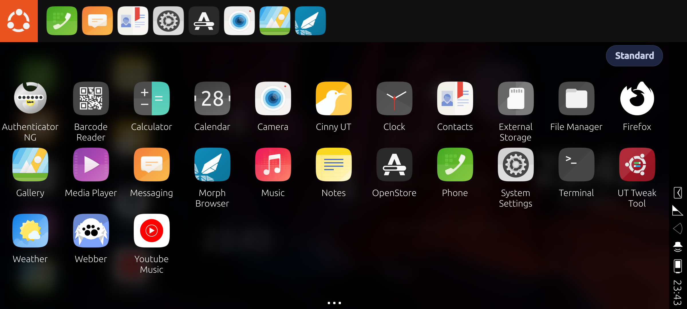</a><br>
      <sub><b>Drawer — Standard</b></sub>
    </td>
  </tr>
  <tr>
    <td align="center" width="50%">
      <a href="pictures/Drawer-Landscape-Mode2.png">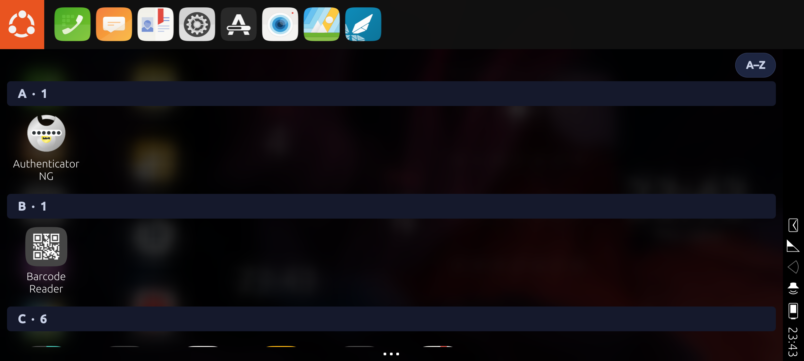</a><br>
      <sub><b>Drawer — A-Z</b></sub>
    </td>
    <td align="center" width="50%">
      <a href="pictures/Drawer-Landscape-Mode3.png">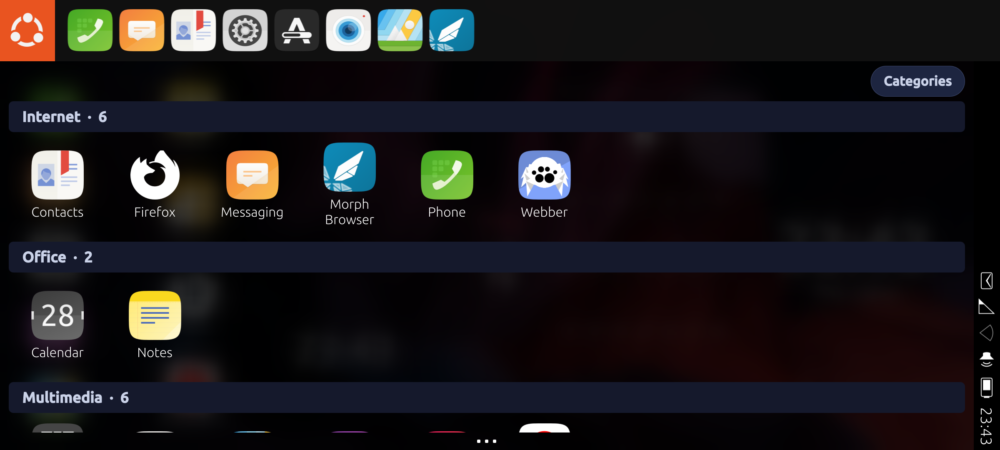</a><br>
      <sub><b>Drawer — Categories</b></sub>
    </td>
  </tr>
</table>

## Features

- **Up to 5 swipeable pages** — add or remove them in edit mode.
- **Folders** — drop one app on another to make one. [More below.](#folders)
- **Widgets** — clock and calendar, fully recolourable. *(See [What's new](#whats-new-in-v2).)*
- **Three placement modes** — Auto-fill, Snap to grid, Place anywhere. [More below.](#placement-modes)
- **Optional dock** for up to 5 apps.
- **Add from the drawer** — long-press any app → *Add to HomeSpike*.
- **Drawer view modes** — Standard, A-Z, or Categories.
- **Home button in the spread**, and the **Ubuntu logo drops you home**.
- **System Settings toggle** — *Settings → Personal → HomeSpike*, on/off live (no restart). Off reverts the phone to stock Lomiri.

## Folders

Group apps on the grid; works in every placement mode.

- **Create** — drag one app onto another and name it.
- **Open** — tap a folder; tap an app to launch, or tap the name to rename.
- **Add / rearrange** — drag an app onto a folder to add it; long-press a member to reorder inside.
- **Pull out** — drag a member past the card edge to drop it back on the grid.
- **Dissolve** — down to one app it becomes a normal icon again; the edit-mode **×** removes the folder (apps stay installed).

## Placement modes

Open edit mode → tap the gear:

| Mode | What it does |
| --- | --- |
| **Auto-fill** | Icons flow with no gaps. Drag to reorder. *(default)* |
| **Snap to grid** | Icons sit on a 4-column grid; gaps allowed. Drop on a cell to place or swap. |
| **Place anywhere** | No grid — drop anywhere, overlaps allowed. |

Each mode remembers its own layout, so switching back restores exactly what you had.

## Device support

Works on **any Ubuntu Touch 24.04 (noble) device running Lomiri**, any CPU architecture — the install ships plain QML that Lomiri loads itself. Reference device: **Poco X3 NFC** (`surya`, aarch64).

You'll need: Lomiri (not pre-Lomiri Unity 8), **developer mode**, your phablet **sudo PIN** (Settings → Privacy & Security), and an **`adb`** connection from a Mac/Linux host. The install replaces five shell files under `/usr/share/lomiri/`; each is backed up as `.orig` and `uninstall.sh` restores them. After a major Lomiri update, re-run the install and watch `journalctl --user -u lomiri` for QML errors.

## Under the hood

HomeSpike is a QML tree loaded by a `Loader` at the wallpaper layer inside Lomiri's own `Stage.qml`. Because it lives in the lomiri process rather than as a separate surface, it never appears in the task switcher — no autostart wrapper, no `.desktop`. Every shell file it touches is shipped as a complete replacement under `app/lomiri-overrides/` (no `sed` patching), so `ls app/lomiri-overrides/` is the full list of what's modified:

| Override | Purpose |
| --- | --- |
| `Shell.qml` | Ubuntu-logo button goes home; launcher panel auto-collapses with the dock |
| `Stage.qml` | Loads HomeSpike at the wallpaper layer; portrait-pins the home |
| `Spread.qml` | Home button in the right-edge spread |
| `Drawer.qml` | *Add to HomeSpike* menu; landscape relayout |
| `LauncherDelegate.qml` | Re-orients side-panel icons in landscape |

"Add to HomeSpike" works through a tiny file inbox the drawer appends to and HomeSpike polls — no D-Bus. Wallpaper and app list come from the same sources stock Lomiri uses (`AccountsService` and `AppDrawerModel`).

## Install

Phone connected over `adb`, developer mode on, from a Mac/Linux host:

```bash
# install — replaces five Lomiri shell files (backs each up as .orig) and reboots
PIN=<sudo-pin> ./deploy/install.sh

# update HomeSpike (auto-detects override changes; restarts Lomiri)
PIN=<sudo-pin> ./deploy/refresh.sh

# uninstall — restores every .orig, removes HomeSpike, reboots
PIN=<sudo-pin> ./deploy/uninstall.sh
```

`PIN` is your phablet sudo PIN. The install is idempotent and OTA-survivable — **a system update resets the shell files, so just re-run `install.sh`** to reapply everything.
